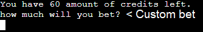
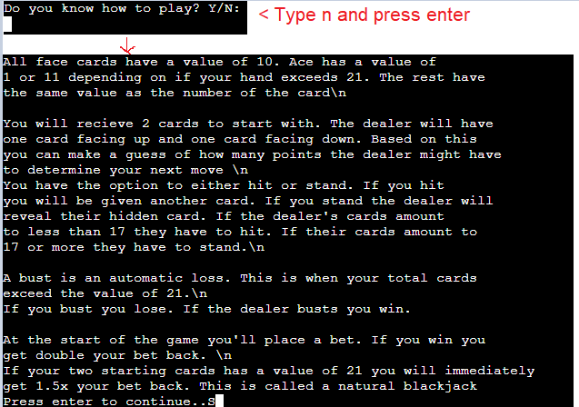
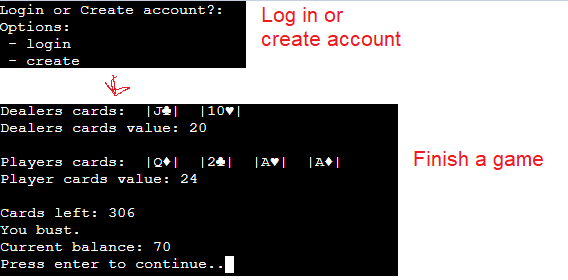
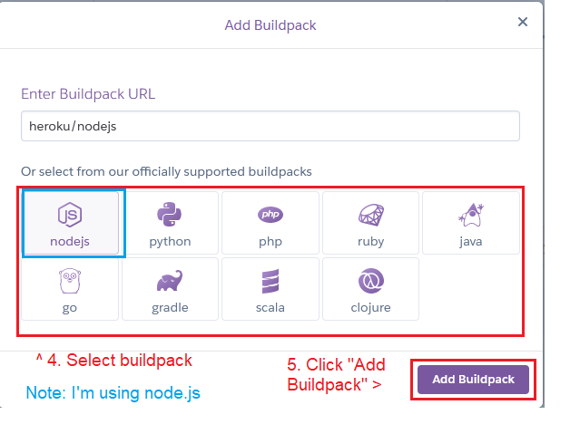

# Blackjack in a Python console

## [Link to website](https://zoten64-blackjack-f933aa260542.herokuapp.com/)

## Table of Contents:

* [Goals and target audience](#goals-and-target-audience)
* [User stories](#user-stories)
* [Features](#features)
* [Bugs and fixes](#bugs-and-fixes)
* [Technologies and tools](#technologies-and-tools)
* [Technical Design](#technical-design)
* [Validation and testing](#validation-and-testing)
* [Deployment](#deployment)
* [Credits](#credits)

## Goals and target audience

The goal of the project is to make a classic game of blackjack in a python console.
It is a classic game of blackjack. You're supposed to get as close to 21 as possible without busting (Going over 21). The dealer will start with two cards, one up and one down, and it is your job to try and guess what the hidden card might be in order to beat the dealer at the game.

The target audience is that of an audience interested in playing blackjack with no real stakes as all money is fictional. As this is a game made to run in a console, no GUI is required

## User stories

1. As a player I want to be able to place a bet so I can start the round with a specific wager
2. As an advanced player I want to know how many cards are in the deck so I can calculate the best outcome
3. As a begginner I want to know the rules of the game so I know how to play. 
4. As a player I want to know what my current balance is so I know if I've won or lost credits
5. As a player I want to know if I've won or lost
6. As a player I want to see the total value of my cards to make it easier to play without counting manually
7. As a player I want to be able to save my progress so I can access it later

## Features

**Welcome screen**

A simple welcome screen that consists of ASCII text displaying "BlackJack". The game will only progress once the player has pressed enter

 

User stories covered: none

**Rules display**

At the begginning of the app it will ask you if you know how to play. If you say no it will display a wall of text of rules

User stories covered: 3

 

**Account system that saves your balance**

You can both create an account and log in at the start of the game. The data is stored securely in a MongoDB Atlas database. The passwords stored are hashed.

Image below of the database entry showing the stored balance

User stories covered: 7

 

**Custom Deck options**

After the login the player will be prompted to choose a number of decks to play with. In real life casinos they usually use 6 decks to make certain strategies harder to pull off, such as card counting where the player keeps an eye on what cards are left in the deck and therefor betting higher when there's a higher chance of getting winning cards, and vice versa

User stories covered: None

 

**Betting**

The game gives the player the option to choose how much to bet. If their balance have reached 0, the game will automatically give them 100 free credits to be able to continue playing.

User stories covered: 1

 

**The board, hitting and standing**

The player is given the choice to hit or stand. Both the player and dealer starts with 2 cards. One of the dealer's cards is hidden, from the user. The user has to guess what that card might be and make a guess based on that. Hitting means the player gains another card, adding to their total value. Standing means it's the dealer's turn.
The game will also display how many cards are left in a deck.

User stories covered: 2, 5, 6
 

**The Dealer's turn**

Once it's the dealer's turn they will reveal their hidden card. If their own value is below 17 they will be forced to pick up cards until they reach 17 or above.

User stories covered: None
 

**Busting**

Both the Dealer and the player has the ability to bust. This is when either of their values go over 21. A bust is an automatic loss for the one who went over 21.

 

User stories covered: None

**Balance**

The player's balance will be displayed at the end of each round.

User stories covered: 4

  

**Unit testing**

The repository also comes with 3 unit tests in the test_run.py file

User stories covered: None
 

## Bugs and fixes

| Bug  | Fix |
| ------------- | ------------- |
| Entered username is always taken according to the script | True and False statements were mixed up |
| Credentials in the .env file keeps on getting messed up on import as it removes vital options | Delete options from the .env file and append them to the DBCREDS string in run.py. The options are not sensitive information |
| The password part of the create_account function runs despite create_username returning "interrupted"  | "interrupted" was misspelt as "inerrupted"|
| Script always outputs that the number of decks needs to be a number despite a number being put in | The conversion to int was not proper. int(ans > 0) instead of int(ans) > 0 making it try and compare a string and an integer before converting to an integer|
| String does not convert to int | Convert the string before the if statement |
| "c" for cancel does not work | Missing () after .lower |
| "cannot access local variable 'balance' where it is not associated with a value" error on a global variable| Declare the variable as global inside function |
| Player wins when the dealer should | accidentally used ">" instead of "<" |
| Player/dealer still bust even if value does not exceed 21 when cards include an Ace due to an Ace counting as 1 when the total value exceeds 21 when the Ace is worth 11 | Change the way the value is calculated by removing 10 when the total value exceeds 21 and there is an ace in the deck | 
| Dealer wins even though they have bust if their card value is higher than the players | Added additional check to make sure the dealer can't win if they bust |
| Balance sometimes displays as {balance} and not as the actual number during a draw | misplaced f in front of the text |

## Technologies and tools
**Languages**
- Python

**Tools**
- Git/github
- Heroku
- Visual Studio Code
- Pip
- MongoDB Atlas
- [ASCII Art generator](https://patorjk.com/software/taag/)
- Lucidchart

**Python Libraries**
- Random
- OS
- Python-dotenv
- pymongo
- dnspython
- pwinput
- bcrypt

## Technical Design

 

Flowchart

## Validation and testing
**Python**

 

PEP 8 

**Testing**

I have played the game extensively myself through every step of the way and solving bugs I have encountered. I have also had a little bit of help from other people with testing in case they would find any bugs. 

I have made sure that any input that could result in an error is handled with the try/except blocks. Any inputs that require a number will loop until it passes without a ValueError. The other inputs will loop until they pass with a valid option.

The dealing of cards, restocking of the decks, not being able to bet more than you have all works as expected. 

As far as I am aware, the program works like it should.

 

**Testing user stories**

1. As a player I want to be able to place a bet so I can start the round with a specific wager

| Feature  | Action | Expected results | Actual results |
| ------------- | ------------- | ------------- | ------------- |
| A function to place a bet at the start of each round | Play the game and enter the amount you want to bed when asked | The bet the player has entered will be added/removed upon a win/loss | Works as expected |

Screenshots

 

2. As an advanced player I want to know how many cards are in the deck so I can calculate the best outcome

| Feature  | Action | Expected results | Actual results |
| ------------- | ------------- | ------------- | ------------- |
| Once the game starts the amount of cards will be displayed | play the game | The amount of cards left will be printed to the console | Works as expected |

Screenshots

 

3. As a begginner I want to know the rules of the game so I know how to play. 

| Feature  | Action | Expected results | Actual results |
| ------------- | ------------- | ------------- | ------------- |
| The game asks if you know how to play in the begginning | At the start of the game, when asked if you know how to play, write "n" and press enter | Rules should be displayed | Works as expected |

Screenshots

 

4. As a player I want to know what my current balance is so I know if I've won or lost credits

| Feature  | Action | Expected results | Actual results |
| ------------- | ------------- | ------------- | ------------- |
| The current balance is displayed at the end of a game as well as when asked how much you want to bet | Place a bet or finish a game | The current balance will display | Works as expected |

Screenshots

 

5. As a player I want to know if I've won or lost

| Feature  | Action | Expected results | Actual results |
| ------------- | ------------- | ------------- | ------------- |
| The game tells you if you've won, lost or if the game ended in a draw at the end | Finish a game | The game telling you if you've won, lost or got a draw | Works as expected |

Screenshots

 

6. As a player I want to see the total value of my cards to make it easier to play without counting manually

| Feature  | Action | Expected results | Actual results |
| ------------- | ------------- | ------------- | ------------- |
| Underneath your displayed cards the total value of your hand will be displayed | Play the game | A display of the value of the cards | Works as expected |

Screenshots

 

7. As a player I want to be able to save my progress so I can access it later

| Feature  | Action | Expected results | Actual results |
| ------------- | ------------- | ------------- | ------------- |
| Save function that saves your balance to the database after each game | Finish a game | The balance will be changed to the current one in the database | Works as expected |

Screenshots

 

## Deployment

**Deploying and accessing the website**

Prerequisities:
- Have a Heroku account with billing information
- Having a project to deploy pushed to github

Steps:
- From the dashboard (First page after logging in), click "new" button on the top right
- Click "Create new app"

Screenshots

 

- Give it a name and a region (I chose Europe as I am in Europe)
- Click "Create App"

Screenshots

 

- You will be taken to the "Deploy" tab in your project. From there, under "Deployment method", click "Github".

Screenshots

 

- Enter the name of your repository and click "search"
- Click "connect" besides the repository you want to deploy

Screenshots

 

- At the very bottom, click "Deploy Branch"
- Wait for the project to be built
- When done a button at the bottom with the text "view" should appear

Screenshots

To access your app at any time, there's a button on the top of the same page called "open app"

Screenshots

 

**How to fork the project**

- Navigate to the github repository (You're probably here already)
- In the right corner click fork and choose a name

**How to clone the project**

Prerequisities:

- Have git downloaded and configured

steps:

- Go to the repository (You're probably here already)
- Click the code button
- Copy the url
- Open git and change the directory to the parent directory that you want the project to clone to
- Write "git clone [the link you just copied]", in this case "git clone https://github.com/Zoten64/blackjack.git"

## Credits

**Code**

- Generating a deck of cards were referenced from [GeeksForGeeks](https://www.geeksforgeeks.org/how-to-print-a-deck-of-cards-in-python/)
- Password hashing functions were referenced from [GeeksForGeeks](https://www.geeksforgeeks.org/hashing-passwords-in-python-with-bcrypt/)
- MongoDB [Documentation](https://pymongo.readthedocs.io/en/stable/)